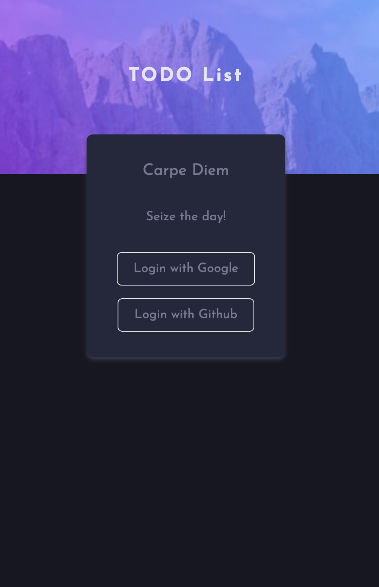
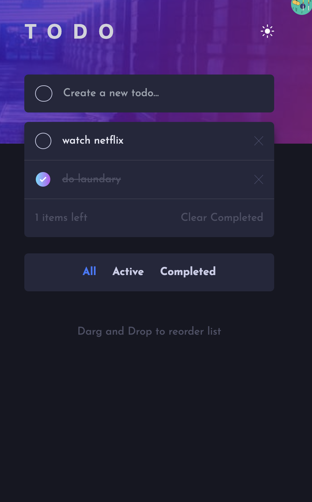
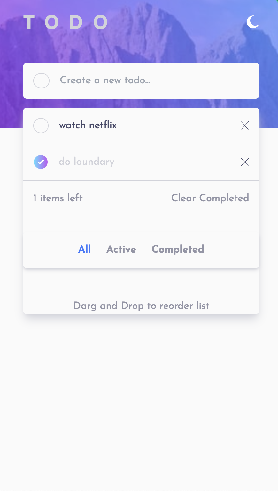

# Frontend Mentor - Todo app solution

This is a solution to the [Todo app challenge on Frontend Mentor](https://www.frontendmentor.io/challenges/todo-app-Su1_KokOW). Frontend Mentor challenges help you improve your coding skills by building realistic projects. 

## Table of contents

- [Overview](#overview)
  - [The challenge](#the-challenge)
  - [Screenshot](#screenshot)
  - [Links](#links)
- [My process](#my-process)
  - [Built with](#built-with)

  - [Useful resources](#useful-resources)
- [Author](#author)

## Overview

### The challenge

Users should be able to:

- View the optimal layout for the app depending on their device's screen size
- See hover states for all interactive elements on the page
- Add new todos to the list
- Mark todos as complete
- Delete todos from the list
- Filter by all/active/complete todos
- Clear all completed todos
- Toggle light and dark mode
- **Bonus**: Drag and drop to reorder items on the list

### Screenshot
**Login View**

**Dark Mode**

**Light Mode**

### Links

- Solution URL: [https://github.com/erke31-2/frontendmentor-reactsupabase-todolist]
- Live Site URL: [https://react-supabase-todolist.netlify.app/login]

## My process

### Built with

- Semantic HTML5 markup
- CSS custom properties
- Flexbox
- CSS Grid
- Mobile-first workflow
- [React](https://reactjs.org/) - JS library
- [Typescript](https://www.typescriptlang.org/)
- [TanstackQuery](https://tanstack.com/query/latest/)
- [Tailwind](https://tailwindcss.com/)
- [ReactRouter]
- [Supabase](https://supabase.com/)

### Useful resources

- [Example resource 1](https://youtu.be/HeNVPF_fRXI) - This helped me for adding drag and drop feature. I really liked this pattern and will use it going forward.

## Author

- Frontend Mentor - [@Kaung Set](https://www.frontendmentor.io/profile/erke31-2)

